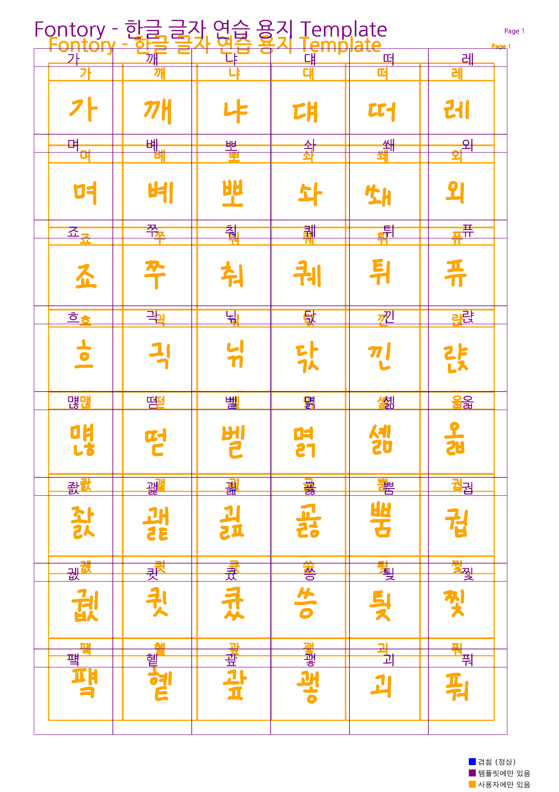
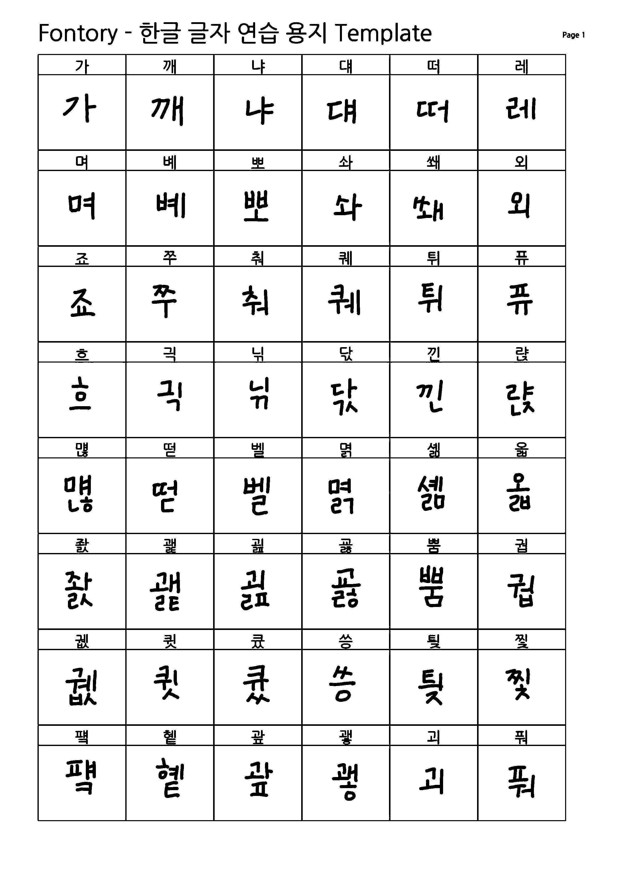
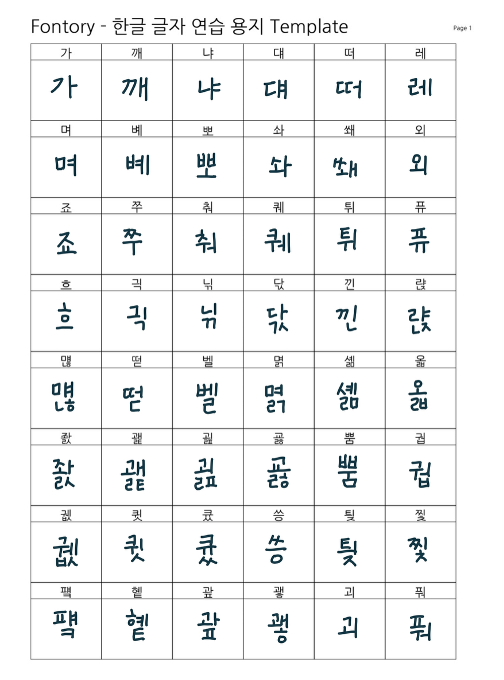
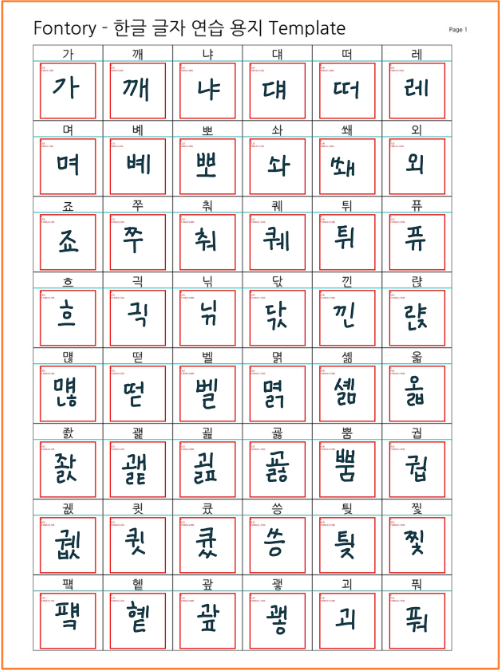
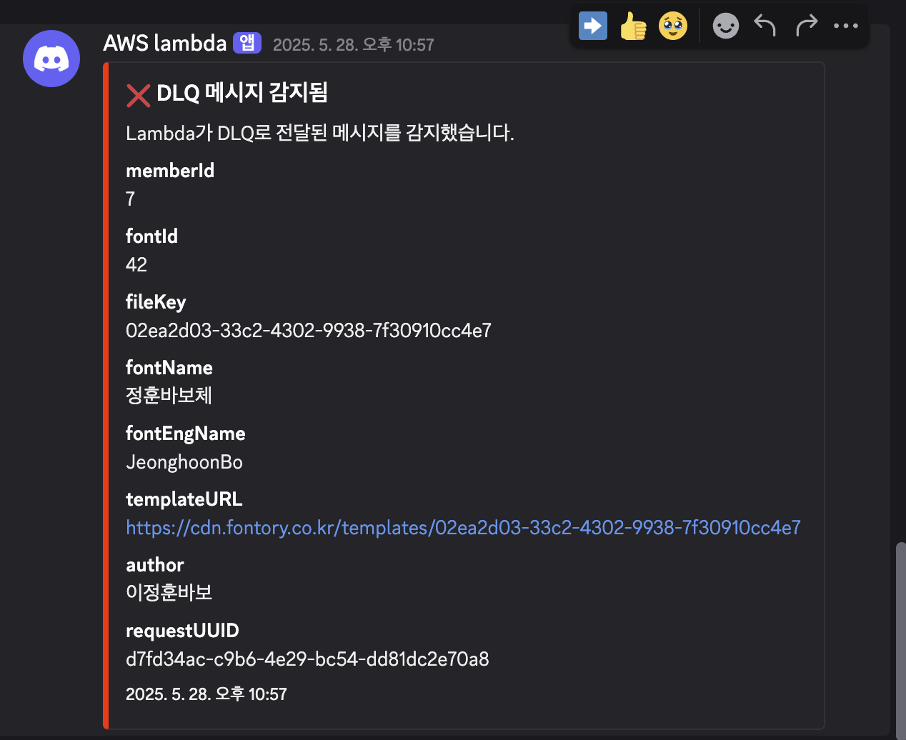
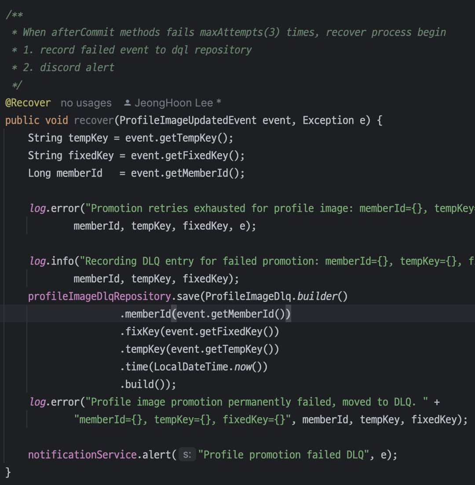
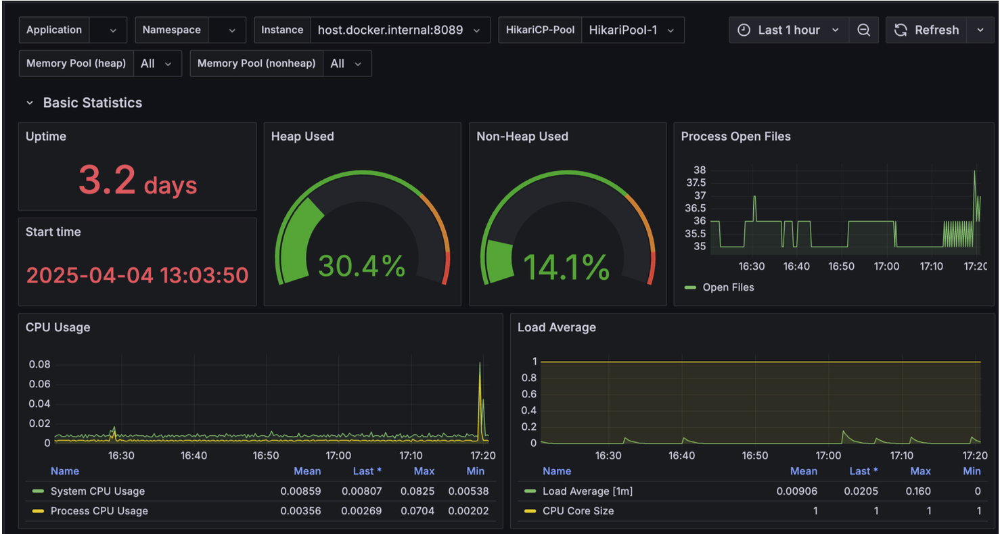
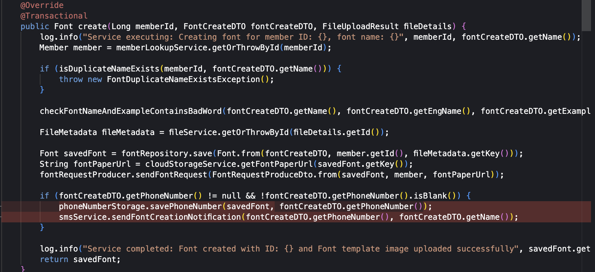

Fontory 프로젝트를 진행하면서 겪었던 여러 트러블 슈팅 기록

[프로젝트 개요 및 동기](https://tape4.io/projects/5-fontory)

---

# 폰트 생성 서버 & 파이프라인

AWS 인프라 위 백엔드 서버뿐만 아니라 손글씨를 폰트로 변환하는 폰트 생성 파이프라인을 직접 설계하고 구현했다.

## 1단계: 이미지 분할

### 문제

-   템플릿 기반 글자 추출 → 템플릿 한 장에서 48개의 글자를 잘라내야 한다.
-   입력 왜곡 검증 필요 → 사용자가 잘못된 크기나 비율로 업로드할 경우가 많다.
-   일괄된 출력 크기 보장 → DM-Font 모델이 128 \* 128 픽셀 크기 파일 사용한다.

### 접근 방식

-   템플릿 무결성 검사를 실시한다.
-   템플릿이 원본 템플릿에 비교해 왜곡이 있는 경우 이미지 보정 및 이진화를 진행한다.
-   템플릿을 Crop 할 때, 좌표를 기반으로 진행한다.

### 결과

-   100% 글자 안정 추출 → 48글자 누락 없이 모두 분리한다.
-   무결성 검사로 인한 폰트생성 오류 0건 → 잘못된 파일 입력 감지 시 즉시 프로세스 중단한다.

  
- 세부 구현 사항

1. 원본 해상도 자동 보정

    실제 사용자가 주어진 원본 템플릿을 다운로드해 글자를 작성한 후 다시 업로드할 때, 해상도가 원본과 달라지는 경우가 많았다. 이러한 왜곡이 격자 좌표와 어긋나면 이후 단계의 Crop 영역이 틀어져 잘못된 글자 조각이 생성되기 때문에, 먼저 모든 이미지를 템플릿 원본의 해상도에 맞춰 자동으로 확대/축소한다. `Pillow`의 `LANCZOS 리샘플링 필터`를 사용해 글자 형태 손실을 최소화하며 원본 해상도로 확대/축소했다. 추가적으로 템플릿이 90도 회전해서 다운로드 되는 경우가 있어 적절하게 회전하고, 무결성을 다시 검사하는 로직도 추가했다.

2. 템플릿 무결성 검사

    업로드된 템플릿이 원본 템플릿과 동일한지 파악하기 위해, 원본 템플릿과 업로드된 템플릿을 각각 이진화 하고 이 결과를 비교해 템플릿의 무결성을 검사했다. 이진화된 결과의 픽셀 단위 차이가 전체 대비 5%를 초과하면 곧바로 에러를 발생시키고 프로세스를 중단한다.

    템플릿 무결성 검사 예시 - 왜곡된 템플릿
    

3. 흑백 이진화 및 색상 후처리

    모델은 검은 글자만을 인식하도록 학습되어있어, 사용자가 검정색이 아닌 다른 색으로 글자를 쓰더라도 반드시 검정색 글자처럼 처리해야 한다. 먼저 사진을 그레이스케일로 변환한 뒤 픽셀 값이 Threshhold(200) 이상이면 흰색(255) 으로, 그렇지 않다면 검은색(0)으로 바꾸어 흑백 이미지로 변환한다.

    | 검정색이 아닌 글씨                                | 검정색으로 변환된 글씨                                 |
    | ------------------------------------------------- | ------------------------------------------------------ |
    |  |  |

4. 좌표 기반 글리프 Crop & 저장

    기획 단계에서 정해진 8 \* 6 격자 템플릿의 각 셀 위치를 기반으로, 48개의 글자를 차례로 잘라낸다. 또한, 각 Crop 영역 위에 격자선과 인덱스를 오버레이한 디버그 이미지를 함께 저장하여, 실제 추출된 프레임워크의 정확도를 눈으로 검증할 수 있도록 했다.

    | 업로드된 이미지                       | 실제 추출할 부분                         |
    | ------------------------------------- | ---------------------------------------- |
    |  |  |

5. 글자 검증 (구현 예정)

    템플릿 검증하는 거 외에도, 올바른 템플릿에 각각 128 \* 128 픽셀로 추출된 각 글리프가 의도한 문자를 정확하게 적어냈는지 확인해야한다. 아직 구현하지는 못했지만 간단한 OCR 엔진을 사용하거나 직접 간단한 CNN 모델을 학습시켜 각 글리프를 인식시킨 뒤, 인식 결과와 기대 문자 비교한다. 이후 불일치 발생 시 템플릿 재업로드 요청하기 정도의 정정 프로세스하면 될 것 같다.

## 2단계: 딥러닝 추론

-   문제
    -   공개된 DM-Font 레포지토리에 Pre-trained 모델이 제공되지 않아, 추론용 모델을 직접 학습 시켜야한다.
    -   GPU 자원이 항상 가용하지 않아, 동기 호출 시 장애 리스크 존재한다.
-   접근 방식
    -   모델 학습 및 추론 컨테이너화했다.
    -   상업적 용도, AI 학습용으로 사용 가능한 어비(Uhbee) 폰트 90개를 이용해 모델 학습시켰다.
    -   배치 사이즈 최적화를 통해 로컬 GPU(4070S)에 적합한 VRAM 사용량 설정했다.

  
- 세부 구현 사항

1. 배치 사이즈 최적화
    - 모델 학습 시에는 VRAM 부족 현상이 발생해 배치 사이즈를 줄여(8 → 4) 안정적인 학습 환경을 만들었다.
    - 추론 시에는 배치 사이즈를 늘려도 VRAM이 부족하지 않음을 확인했다. → batch 사이즈를 늘려(16 → 32) 빠른 추론시간 확보했다. (평균 2분)
2. 학습/추론 컨테이너화
    - 각각 `Dockerfile`, `compose.yml` 작성을 통해 운영환경이 바뀌더라도 쉽게 학습, 추론할 수 있게끔 컨테이너화했다.
3. 추론 시간 측정
    - `time.time()` 으로 경과 시간을 계산해 `추론 완료: XX.XX초 소요` 형태로 로깅한다.
      

---

## 3단계: 벡터화

### 문제

-   DM-Font 모델이 생성한 `이미지(PNG)`를 `벡터(SVG)` 형태로 변환해야 한다.

### 접근 방식

-   `BMP` 전처리 & 잡티 제거 로직을 추가했다.
-   `Potrace SVG` 변환을 이용한다.
-   결과 검증 및 통계 수집한다.

### 결과

-   127개 평균 압축 비율 1.29x → 22.8%으로 평균 용량 절감했다.

  
- 세부 구현 사항

1. BMP 전처리 & 잡티 제거
    - 연결 요소 분석으로 50px 미만 작은 컴포넌트를 제거해 잡티 필터링 로직을 추가했다.
2. SVG Convert
    - `potrace -s -o output.svg input.bmp` 으로 `BMP → SVG` 변환로직을 추가했다.
3. 결과 검증 및 통계 수집
    - `SVG` 파일 존재 여부 및 크기(바이트) 확인 → 압축비`(input_size/output_size)` 계산한다.
    - `SVG` 내부 `<path>` 태그 개수 파싱하여 벡터 요소 수 집계한다.
      

---

## 4단계: 폰트 파일 생성

### 문제

-   개별 글자 11,172개를 하나의 완성된 폰트 파일`(TTF/WOFF2)`로 만들어야 함
-   추론 모델은 오직 한글로 만들 수 있는 글자(11,172개)만을 추론하며 영어, 특수문자 등이 존재 하지 않음. 이를 다른 폰트에서 추출하고 사용자 글자에 통합할 때 자간, 메트릭 불일치가 발생할 수 있음

### 접근 방식

-   Base 폰트 병합
-   수직 메트릭 계산 및 조정
-   TTF 파일 생성
-   WOFF2 변환

### 결과

-   완성 파일: `.ttf`, `woff2` 파일을 생성하며 문서 툴이나 웹 브라우저에서 즉시 사용 가능
-   용량 최적화: `woff2` 압축 후 파일 크기 약 52% 감소
-   폰트 사용성: 생성 한글 11,172 글자 + 영어, 특수문자 등 180 글자 포함

  
- 세부 구현 사항

1. Base 폰트 병합 및 후처리

    - 사용자 글자와 어비(Uhbee) 폰트 속 라틴, 특수문자 180 글리프를 병합
    - 그룹별 스케일, 기준선 정렬 로직으로 폰트 간 크기, 정렬 일관성 유지
    - Unicode 범위별(자모, 라틴, 특수문자) 스케일링 비율 적용 후 기준선 정렬

    | 적용 전: 일관 되지 않은 글자 높이                                                      | 적용 후: 일관된 글자 높이                                                      |
    | -------------------------------------------------------------------------------------- | ------------------------------------------------------------------------------ |
    |  |  |

2. 메트릭 조정
    - 전체 글리프 바운딩 박스 최대/최소 Y값 집계
    - Padding 값을 더해 Ascent/Descent 재설정 → OS/2, hhea 테이블 업데이트
3. TTF 생성
    - `FontForge` 스크립팅 API로 `.ttf` 파일 생성
4. WOFF2 변환
    - `fontTools`의 WOFF2 압축 기능으로 `.ttf` → `.woff2` 변환
5. 최종 로깅

    

---

# 트러블 슈팅

## SQS 도입

딥러닝 추론 단계에는 GPU 자원이 필요했지만, 팀 내에서 상시 사용 가능한 GPU 장비가 부족했다. 유일한 GPU가 탑재된 내 로컬 PC는 100% 가용성을 보장할 수 없기 때문에, **AWS** 위의 백엔드 서버가 로컬 모델 서버를 직접 호출하는 동기 방식에서는 시스템 신뢰성에 한계가 있었다. 이를 해결하기 위해 **AWS SQS**를 도입해 폰트 생성 작업 요청을 큐에 적재하고, 로컬 모델 서버 **FastAPI**가 해당 큐를 지속 폴링하여 비동기로 작업을 수행하도록 구조를 변경했다. 이러한 설계로 백엔드 애플리케이션과 모델 추론 작업을 느슨하게 연결해, 모델 서버가 항상 켜져 있지 않아도 요청을 안정적으로 처리할 수 있게 되었다.

단순히 **SQS**만으로는 부족했다. 작업 처리 중 예외가 발생하면 동일 메시지가 반복적으로 재처리되어 지속적으로 오류를 발생시키는 문제가 있었다.

이를 개선하기 위해 **Dead Letter Queue**를 추가로 구성하여 최대 재시도 횟수를 초과한 메시지를 자동으로 격리하고 별도 큐로 분리했다. 그리고 **AWS Lambda** 를 연동하여 **DLQ**에 쌓인 실패 건을 디스코드 알림으로 즉시 받아볼 수 있도록 구현했다.

**SQS+DLQ** **기반 비동기 파이프라인** 구조는 실제 서비스 환경에서도 예외를 빠르게 감지하고 대응하는 데 효과적이었다.

---

## 외부 API 연동에서 트랜잰션 일관성 보장하기 : 프로필 이미지 업로드

**AWS S3** 같은 외부 스토리지와 로컬 데이터베이스를 함께 사용할 때, “한 번의 트랜잭션”으로 묶어 일관성을 보장하기 어려움이 있었다. **S3** 업로드는 **HTTP** 호출로, **DB** 커밋은 **JDBC** 트랜잭션으로 처리되기 때문에, 어느 한쪽이 실패하면 두 스토리지의 상태가 어긋나게 된다.

-   **S3** 업로드가 실패한 경우 → DB에만 새 키가 존재
-   DB 커밋 실패 → **S3** orphan 파일 존재 (비용 누수)

이러한 문제를 해결하기 위해 **Two-Phase Commit** 개념을 차용해 적용했다.

“스테이징 → 프로모션” 두 단계로 나누고, 비동기 / 재시도 / Recover / DLQ / 알림 / 롤백 클린업까지 적용한 업로드 로직을 완성했다.

물론 **AWS SQS**와 **Lambda** 등을 조합해 전체 자동화 재처리 파이프라인을 구성할 수 있었다. 하지만 이미 **폰트 생성 서버**와 **Spring 백엔드** 간에 **AWS SQS**를 활용하는 구조가 있고, 이번 프로필 이미지 업로드는 장애 발생 빈도가 매우 낮은 로직이라고 판단했다. 따라서 추가적인 인프라 도입으로 인한 오버 엔지니어링을 피하고 **Spring**의 **ApplicationEventPublisher** 만을 이용해 구현 했다.

---

-   스테이징 단계

업로드 메서드는 하나의 트랜잭션 내에서 다음 로직을 동기적으로 실행한다.

1. **tempKey**로 **S3**에 프로필 사진 업로드
2. DB에 메타데이터 저장
3. 프로필 이미지 업로드 이벤트 발행

이때 각각 **tempKey**로 **S3**업로드, DB에 메타데이터 저장은 스테이징 단계에 해당되며, 발생할 수 있는 실패 시나리오는 다음과 같다.

| 시나리오       | 실패 지점          | DB 상태   | S3 상태   | 처리 방법                     |
| -------------- | ------------------ | --------- | --------- | ----------------------------- |
| S3 업로드 실패 | S3 upload(tempKey) | 변경 없음 | 변경 없음 | 클라이언트 예외 반환 → 재시도 |

> DB 저장 실패는 “시스템·인프라 문제” 혹은 “논리적 예외”로 간주해 별도로 복잡한 보상 로직을 두지 않았다.

---

-   프로모션 단계

스테이징에 성공(커밋)하면 새로운 트랜잭션에서 다음을 동기적으로 실행한다.

1. **S3 tempKey 객체** → **fixedKey**로 객체 복사
2. **S3 tempKey 객체** 제거
3. **Member** 객체 속 **profileImageKey** 업데이트

이때 중요한 가장 중요한 점은

-   프로모션 트랜잭션은 스태이징 트랜잭션과 별도의 트랜잭션으로 실행되어야 한다.
    → 스테이징 트랜잭션이 커밋되는 즉시 사용자게에게 빠른 응답을 반환하면서, 프로모션 실패 시 메인 트랜잭션을 롤백하지 않고 독립적으로 재시도, 보상 로직을 적용하기 위해 별도의 트랜잭션이 필요하다.
-   프로모션 트랜잭션의 실행 시점은 스테이징 트랜잭션의 커밋 이후여야 한다.
    → 스테이징 트랜잭션이 완전히 성공(커밋) 되기 전에 복사나 삭제를 시도하면, “존재하지 않는 객체”를 참조하거나, 커밋되지 않은 데이터 위에서 작업해 불일치가 발생할 수 있기 때문에, 확정된 상태에서만 프로모션을 수행해야 한다.
-   프로모션 트랜잭션 또한 실패할 가능성이 있다.
    → 외부 API 호출 또한 여러가지 이유(네트워크 지연, 권한 등) 언제든지 실패할 수 있다. 따라서 재시도 로직과 보상 로직이 필요하다.
-   프로모션 트랜잭션은 비동기로 실행되어야 한다.
    → 프로모션 단계는 외부 API 호출과 재시도 로직 때문에 지연 시간이 길어질 수 있어, 동기 실행 시 사용자 요청 처리 전체가 블로킹 된다.

위 네 가지 사항을 모두 고려해서 프로모션 단계를 구현해야 한다.

이는 모두 스테이징 단계에서 발행한 이벤트에 대한 이벤트 리스너가 처리하며 다음과 같은 어노테이션을 이용해 구현했다.

-   **@Transactional(propagation = _REQUIRES_NEW_)**
    → 해당 이벤트를 발행한 트랜잭션(스테이징)과 별도의 트랜잭션으로 실행한다.
-   **@TransactionalEventListener(phase = TransactionPhase._AFTER_COMMIT_)**
    → 해당 이벤트를 발행한 트랜잭션(스테이징)이 성공(커밋)된 후에만 프로모션을 수행한다.
-   **@Retryable(maxAttempts = 3, backoff = @Backoff(delay = 2000))**
    → 프로모션 트랜잭션 또한 실패할 수 있기 때문에, 최대 3번까지의 재시도 로직을 가지고 있으며, 모든 재시도가 실패할 경우를 위한 **Recover** 메서드를 구현했다.
-   **@Async**
    → 스테이징 트랜잭션과 분리된 별도의 스레드에서 실행함으로써 응답 속도를 해치지 않고, 시스템 처리량과 장애 완화를 확보한다.

---

3번의 재시도 로직을 모두 실패할 때 호출할 **Recover** 로직을 설계하면서, 장애 발생 후 보상 전략을 어떻게 구성할지 두 가지 방식을 검토했다.

1. 자동 재처리 파이프라인

-   **DLQ 테이블**에 실패한 이벤트 저장
-   **DLQ 테이블**을 주기적으로 스캔해 실패 이벤트를 자동 재처리 (**Spring Batch** or **스케줄러**)
-   재처리 실패 시 알림 → 무한 루프 없이 일정 횟수만 시도

1. **DLQ** 적재 + 수동 재처리

-   **DLQ 테이블에** 실패한 이벤트 저장
-   즉시 Discord 웹훅으로 실패 알림 발송
-   알림을 보고 수동으로 **tempKey** → **fixedKey** 복사, 이동, 삭제 처리

각각 장단점이 있지만, 작은 팀의 개발과 운영 여건을 고려해 두 번째 방식을 채택했다. 우선 장애 건수가 드물고, “**DQL** 적재 → Discord 알림 → 수동 패치” 방법으로도 충분한 안정성과 관리 편의성을 확보할 수 있다고 판단했다.

Recover: DLQ 적재 + Discord 알림

프로모션 단계의 실패 시나리오는 다음과 같다.

| 시나리오          | 실패 지점             | DB 상태                | S3 상태                       | 처리 방법                                                                        |
| ----------------- | --------------------- | ---------------------- | ----------------------------- | -------------------------------------------------------------------------------- |
| S3 복사 단계 실패 | s3 copy(temp → fixed) | profileImageKey 미반영 | tempKey만 존재                | @Retryable 3회 재시도 → @Recover 실행 → DLQ 기록 + Discord 알림 → 수동 복구 필요 |
| S3 삭제 단계 실패 | s3 delete(temp)       | profileImageKey 미반영 | tempKey + fixedKey 둘 다 존재 | @Retryable → @Recover → DLQ 기록 + Discord 알림 → 수동으로 tempKey 제거          |

일시적인 장애들은 반복 재시도 로직(**@Retryable**)을 통해 대부분 자동으로 복구되도록 설계했으며, 3회 재시도 후에도 복구되지 않은 사례는 **Recover** 로직으로 **DLQ**에 기록하고, Discord 웹훅으로 누락없이 즉시 인지할 수 있도록 구현했다.

---

## 폰트 랜더링 병목 분석과 CDN 전환

프론트엔드쪽 폰트 렌더링 단계에서 문제를 마주했다. 여러 개의 커스텀 폰트를 동시에 화면에 렌더링할 때, 텍스트가 늦게 나타나는 병목이 발생했고, 분석 결과 **woff2** 파일 동시 로딩으로 인한 네트워크 병목임을 확인했다. 이를 **AWS S3**로 직접 접근하는 방식에서 **AWS CloudFront CDN** 으로 전환하면서 **x-cache: Hit from cloudfront** 캐시가 적용되었고, 테스트에서 다운로드 시간은 493ms에서 13ms, FCP는 1.8초에서 0.6초로 크게 단축되었다.

이를 계기로 성능 최적화뿐만 아니라 병목을 사전에 감지하고 대응하는 체계가 중요하다는 것을 깨달았다. 이에 **Prometheus, Loki, Grafana**를 도입해 시스템 메트릭과 로그를 실시간 시각화하며 통합 모니터링 환경을 구축했다.

| Grafana 대시보드                                                     | 실시간 로그 확인                                                       |
| -------------------------------------------------------------------- | ---------------------------------------------------------------------- |
|  |  |

---

## 실시간 모니터링을 활용한 성능 개선

실제 운영에서도 이 모니터링 시스템은 유용하게 작동했다. **Grafana** 대시보드를 통해 특정 API의 응답 속도가 평균 10배 이상 느리다는 사실을 확인했고, 원인은 동기적으로 처리되던 외부 문자 알림 API 호출임을 알 수 있었다.

이를 **Spring**의 **ApplicationEventPublisher** 기반 비동기 이벤트 구조로 개선해 응답 흐름을 내부 처리와 외부 API 처리로 각각 별도의 스레드로 분리한 결과, 평균 응답 시간이 67% 단축되었고, 외부 API 오류도 내부 흐름에 영향을 주지 않도록 구조적으로 분리할 수 있었다.

외부 API와 동기적으로 실행되었던 폰트 생성 로직

외부 API 로직과 폰트 생성 로직을 서로 다른 프로세스가 처리 하도록 분리

| 기존 응답속도                                                       | 리펙터링 후 응답속도                                                       |
| ------------------------------------------------------------------- | -------------------------------------------------------------------------- |
|  |  |

---
