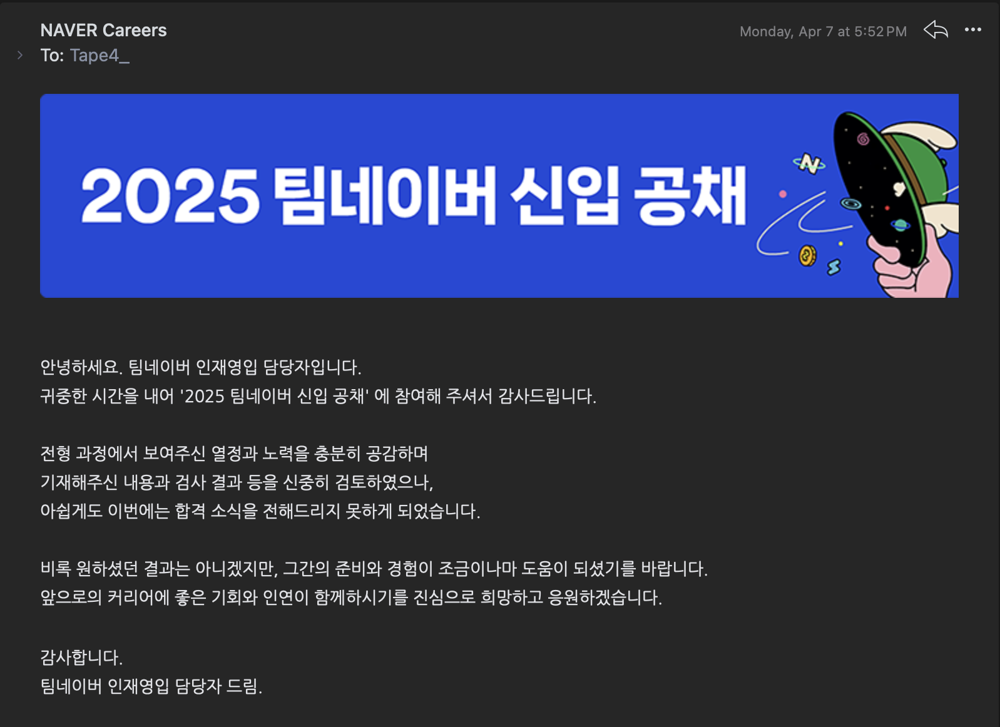
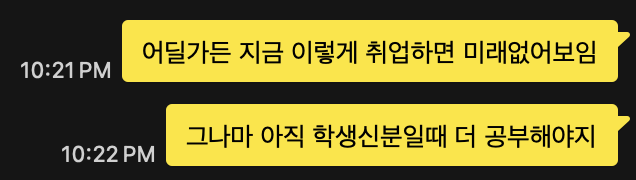
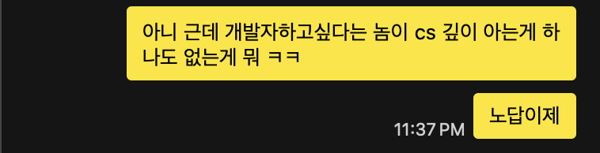

쓸까말까 고민하다가 주변의 적극적인 추천으로 인해 쓴 네이버.

# 자기소개서

4(5)가지 문항.

## 1번

> **[필수] 다음 중 본인의 가장 자신 있고 희망하는 분야를 한 가지 선택해 주세요.■ Front-End ■ Back-End ■ Android ■ iOS ■ Data ■ 공통※ 구체적인 희망 분야가 미정이신 경우 '공통'으로 선택해 주세요.※ 작성 가이드 : 자기소개서 전체 문항의 답변 내용에 대외비, 이해관계 상충 등의 정보는 제외하여 주시기 바랍니다.**

Back-End

## 2번

> **[필수] 위 문항에 응답하신 분야로 지원을 결정한 계기와, 입사 후 성장 목표를 작성해 주세요.**

가장 답변이 어려웠고 작년에는 없었던 문항. 소프트웨어 마에스트로를 시작으로 웹개발을 시작했고, 그대로 백엔드로 빠져들었다는 내용을 담았다. 추가적으로 입사후의 단기적, 장기적 구체적인 목표를 담았다.

## 3번

> **[필수] 스스로의 의지로 새로운 도전이나 변화를 시도했던 경험을 작성해 주세요.**

운영체제 과제와 이를 통한 시스템 프로그래밍에 대한 관심, 그리고 이어진 Rust를 학습한 내용과 컴파일러에 대해 담았다.

## 4번

> **[필수] 팀 혹은 모임 내에서 도전적인 과제를 진행하며 중요한 책임을 맡았던 경험과 그 결과를 작성해 주세요.**

UMC 개발 내용과 함께 AWS Associate Deveopler 자격증 취득 내용을 담았다.

## 5번

> [선택] 본인의 대표적인 개발 경험이나 희망 분야 관련 과제 성과, 활동 등을 가장 잘 보여줄 수 있는 GitHub, 블로그 등의 URL을 작성하시거나자료를 첨부하시고, 간단한 소개나 설명을 해 주세요. 공동 프로젝트였다면 본인의 역할을 명확히 써 주세요.※ 오픈소스 컨트리뷰션, 프로젝트, 본인이 작성한 소스코드 등 (임시저장 후 복수 첨부 가능 / 최대 200MB)※ 수강하셨거나 별도로 공부하신 컴퓨터공학 관련 학습/과제/프로젝트 활동을 보여 주셔도 좋습니다.

위에서 언급한 프로젝트들의 Repository, 대외활동 내용들.

---

# 코딩테스트

3 문제

2시간 동안 3문제 풀기. 오랜만에 코딩테스트였다. 대략 4년 전에 카카오 신입 2차 코테를 응시 했던것이 기업 코테는 마지막이었는데, 마침 병원을 다녀온 차라 컨디션이 매우 좋지 않았다. 세 문제를 보자마자 모두 기본 유형은 파악할 수 있었다.

1. 슬라이딩 윈도우
2. 구현
3. 비트맵

그러나 1번을 여러 번 읽어도 너무 어지러워서 잠깐 명상하고 2번, 3번부터 풀이했다. 결국 2, 3 번 모두 풀이하고 1번은 절반밖에 풀이하지 못했다. 물론 완벽하게 점수를 알 수 없지만, 세 문제 모두 내가 파악한 것처럼 하나의 알고리즘에 국한된 것이 아니라, 최소 두 개의 알고리즘을 혼합해 풀이해야 이상적인 솔루션을 낼 수 있는 문제들이었다.

그래도 문제들을 처음 본 순간에 대략적인 핵심 알고리즘들을 파악할 수 있었음에 스스로 다행임을 느꼈다. 지금처럼 1일 1백준 열심히 하면 내년에 분명히 다 맞출 수 있을 것 같다.

---

# CS

20문제

http, 알고리즘, sql 등등 기초 cs문제

CS 많이 부족하다. 특히 네트워크쪽.

---

# 결과

뜨거운 합격

사실 알고있었다. 지금 스스로 너무 부족하다. 내가 인사담당자라면 지금의 나를 안뽑을 것 같다. 내년에는 스스로 좀더 당당해지도록 열심히 해야지.

고민했는데 쓰길 잘했다. 메타인지, 공부자극 굿. 덕분에 마지막 남은 학기 후회하지 않도록 불태워야지.

