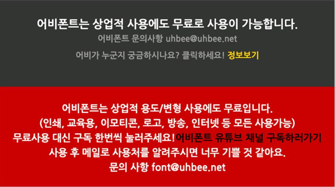
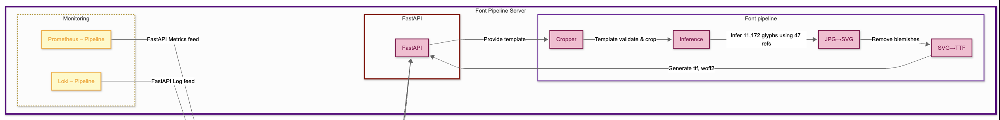
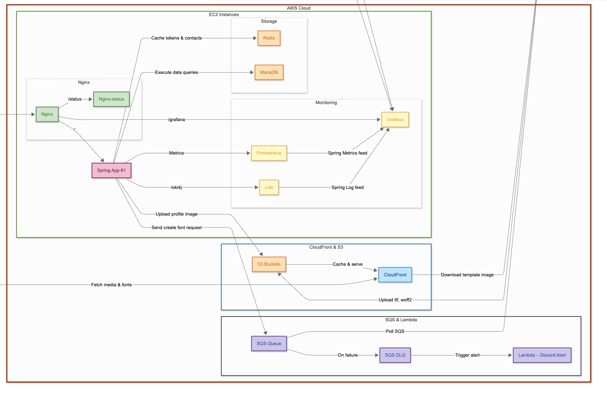
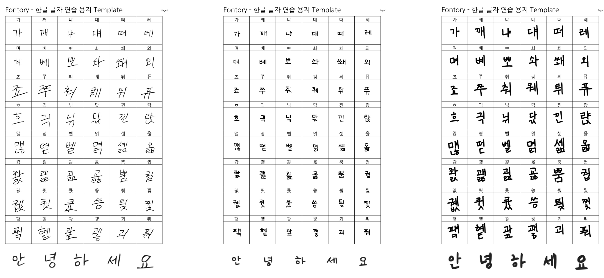

-   팀장
-   2025.03 ~ 2025.06
-   아키텍처 설계
-   백엔드 개발
-   폰트 생성 모델 서버 개발
-   Java / Python / Spring boot / FastAPI / AWS (EC2, Lambda, SQS, CloudFront, S3) / Nginx / Docker / Github Actions / Redis / MariaDB / JWT

---

# 소개

2022년 소프트웨어 마에스트로를 할 당시부터 사람의 개인적인 개성을 이용하는 프로젝트를 진행하고 싶었다. 당시에는 목소리를 활용해서 개인적인 TTS를 얻을 수 있도록 하고 싶었는데, 담당 멘토님의 "보이스피싱에서 쓰기 너무 좋겠는데?" 라는 피드백과, 실질적 구현가능성, 수익화 방법 등 여러 문제에 부딪혀 결국 다른 주제로 프로젝트를 진행했다.

인류가 산업혁명을 지나오며 대량생산 -> 개인화된 물건으로 바뀌었듯이 AI가 발전함에 따라 동일한 프로덕트보단 더더욱 개인화된 프로덕트를 만들 수 있게 되었다. 폰트는 개인이 가지기 어려운 프로덕트다. 특히 한글 폰트의 경우 만들어야 하는 글자수(11,172)가 영어(92)에 비해 매우 많다. 이에 디자이너가 모든 글자들을 디자인하고, 검토해야하기 때문에 비용과 시간에 있어서 매우 많은 비용을 요구한다. Fontory는 이런 문제를 해결하기 위해서 만들었다. 오래, 그리고 비싼 비용을 치뤄야만 얻을 수 있는 개인 폰트를 AI를 이용해 쉽고 빠르게 얻을 수 있도록 헸다.

약간의 욕심을 섞자면, 죽기전에 나의 흔적을 글씨로나마 세상에 남기고 싶었다.

Fontory는 React 프론트엔드, AWS 인프라 위의 Spring Boot 백엔드, 그리고 내 로컬 PC에서 실행되는 FastAPI 기반 폰트 생성 파이프라인으로 구성된 3계층 아키텍쳐를 통해 손글씨 폰트 생성 과정을 자동화한다.

---

# 시스템 아키텍처

[아키텍쳐](https://github.com/team-fontory/.github/blob/main/profile/struct.svg)

## 인프라 및 CI/CD 파이프라인

AWS EC2 프리티어 환경에서 Docker를 활용해 인프라를 구축하고, 운영환경이 변경되어도 쉽게 재배포 할 수 있도록 Nginx 리버스 프록시 아래에 Spring Boot 애플리케이션과 MariaDB, Redis를 포함한 모든 백엔드 구성 요소들을 컨테이너로 배포했다. 실제로 EC2외에도 테스트용도로 사용하기 위해서 개인적인 맥미니에도 백엔드 서버를 배포했는데, 컨테이너로 인프라를 구축한 덕분에 쉽게 배포할 수 있었다.

Github Action을 이용해 CI/CD 파이프라인을 설계하고, Rolling update 쉘 스크립트를 작성해 무중단 배포 방식을 사용했다.

## 폰트 생성 서버

### 폰트 생성 모델

폰트 생성 서버는 정말 많은 시행착오가 있었다. 많은 모델들을 Github 상에서 검색해보고 몇몇 괜찮은 후보들을 추려보았다. 불친절한 README 그리고 오래된 구동환경과 내 로컬 PC 환경의 차이를 맞추기 위한 많은 삽질들 끝에 사용할 모델을 찾았다. 우리가 사용할 모델은 Naver Clova AI Research에서 공개된 오픈소스 DM-Font 모델이다. 오픈소스로 공개된 이 DM-Font 모델은 Pre-trained 모델이 제공되지 않기 때문에, 직접 학습에 필요한 데이터를 찾아 모델을 학습 시켜야 한다. 우리도 이미 모든것이 되어있는 모델을 그대로 가져다 쓰는것이 아닌, 연구 수준에 머물러 있던 이 기술을 운영가능한 웹 서비스 형태로 만드는 것을 목표로 했다.

먼저 학습에 필요한 데이터는 어비(Uhbee)폰트를 사용했다. 이는 무료 폰트로서 저작권, AI 학습 용도로 사용해도 상관이 없기 때문에 어비 폰트를 사용해서 모델을 학습시켰다.

추가적으로 DM-Font 모델은 오직 한글 11,172자만을 생성해낼 수 있기 때문에, 실제로 폰트를 사용하기 위한 영어, 특수문자 등 또한 어비폰트에서 추출해 생성해낸 폰트에 병합했다.

### 폰트 생성 서버 아키텍처

폰트 생성은 기본적으로 GPU를 사용하기에 평소 백엔드 개발을 통해 배포하던 AWS에 이를 위치할 수는 없었다. 내 로컬 PC가 AWS처럼 99% 가용성을 자랑할 순 없지만, AWS에서 GPU를 사용하기 위해서는 꽤나 많은 금액을 지불해야 한다. 그렇게 어쩔 수 없이 내 로컬 PC에서 폰트 생성 서버를 구축했다. 이에 SQS를 도입하게 되었는데 도입 배경과 이유에 대해서는 밑에서 자세히 다룬다.

폰트 생성 파이프라인은 다음과 같다.

-   1단계 이미지 분할
-   2단계 딥러닝 추론
-   3단계 벡터화
-   4단계 폰트 파일 생성

유연하고 빠른 개발과 특정 단계에서의 오류가 전체 파이프라인에 미치는 영향을 최소화 하기 위해서 각 단계를 컨테이너 단위로 모듈화 했다. 폰트 생성 요청을 받은 FastAPI가 직접 각 단계를 독립된 Docker 컨테이너에서 격리시켜 호출하며, 중간 산출물은 호스트의 공유 볼륨을 통해 다음 단계로 전달하고 발생한 오류 또한 각 단계가 아니라 이들을 호출하는 FastAPI가 일괄적으로 처리한다.

폰트 제작 요청을 처리하는 FastAPI 서버까지 컨테이너화 하면, Docker in Docker 문제가 발생할 수 있고, Python의 가상환경과 requirement.txt를 이용해 FastAPI에 필요한 의존성을 정의했다. 이렇게 함으로써 운영 환경이 바뀌더라도, 즉 여유 GPU 자원이 생겨도 충분히 쉽게 재배포할 수 있도록 서버를 작성했다.

## 백엔드 서버

### 백엔드 서버 아키텍처

백엔드 서버는 Spring Boot를 이용해 AWS EC2에 배포했으며, 사진 업로드를 위한 S3, 캐싱을 위한 Cloudfront, 폰트 생성 서버와의 연동을 위한 SQS, Lambda를 사용했다. 예전 프로젝트에서는 Https 적용을 위해 AWS LoadBalancer를 사용햇었는데, IP주소가 부족해짐에 따라 변경된 AWS정책 때문에 과금이 되어서 Nginx 컨테이너와 Certbot을 이용해 구매한 도메인에 Https를 적용시켰다.

AWS 위에 백엔드 서버가 로컬 모델 서버를 직접 호출하는 동기 방식에서는 로컬 서버가 100% 가용성을 보장하지 않기에 시스템 신뢰성에 한계가 있었다. 이에 AWS SQS를 도입해 폰트 생성 요청을 큐에 적재하고, 로컬 모델 서버(FastAPI)가 해당 큐를 지속적으로 폴링하여 비동기로 작업할 수 있도록 구조를 설계했다. 이러한 설계로 백엔드(AWS)와 모델 추론 서버(로컬PC)를 느슨하게 연결해 모델 서버가 항상 켜져 있지 않아도 요청을 안정적으로 처리할 수 있게 되었다.

추가적으로 SQS만으로는 폰트 생성 작업 처리중 예외가 발생하면 동일 메시지가 반복적으로 재처리되는 문제가 있었다. 이를 개선하기 위해 Dead Letter Queue(DLQ)를 추가로 구성해 최대 재시도 횟수를 초과한 메시지를 자동으로 격리하고 별도 큐로 분리했다. 그리고 AWS Lambda를 연동해 DLQ에 쌓인 실패 건을 디스코드 알림으로 즉시 받아볼 수 있도록 구현했다. 이렇게 만든 SQS + DLQ로 비동기 파이프라인 구조는 실제 여러번 테스트하면서도 예외를 빠르게 감지하고 대응하는데 효과적이었다.

### 로그인

이번에 처음으로 Spring Security를 이용해 OAuth2 로그인을 구현했고, 이 과정에서 Access Token, Refresh Token 을 사용했다. 로그인을 프로젝트에서 몇번 구현해보았고, 주변에 많이 물어도 봤지만 딱히 표준이랄게 없고 어떻게 짜느냐에 따라서 많이 달라지는 부분인 것 같다. 이번 프로젝트는 프론트엔드 쪽 인력이 부족했다. 따라서 로그인쪽 프론트엔드에서의 수고(요청시 만료 -> 재발급 -> 재요청)를 덜어주고자, Access Token과 Refresh Token을 모두 쿠키에 저장하고 만료된 Access Token으로 요청시 두 토큰을 모두 재발급하고 요청을 이어서 진행하는 로직을 Security Filter단에 넣었다. 이렇게 하면 백엔드쪽에서 쿠키를 통해 사용자 인증 여부를 판단하고 응답을 주기 때문에 프론트엔드에서는 토큰 로직 상관없이 그냥 요청만 하면된다. 하지만 이 로직은 프론트엔드단에서는 현재가 로그인이 되어있는지 확인할 수 없다. 따라서 /auth/me 엔드포인트로 현재 로그인이 되어있는 상태인지 확인 할 수 있는 API를 뚫어 놓았다.

두 토큰을 모두 쿠키에 넣음으로서 얻는 보안상 이점도 분명있겠지만, 불필요한 API를 하나 더 뚫어야하는 만큼 다른 방법보다 훨신 더 좋은 방법이라고 생각이 들진 않는다. 가장 괜찮은 방법은 Refresh Token만을 쿠키에 저장하고, Access Token은 그냥 프론트단에서 메모리에 관리하는게 좋은 방법이라 개인적으로 생각한다.

### 로깅 & 모니터링

이번 프로젝트를 진행하면서 새롭게 해본것이 많은데, 그중 하나로서 Prometheus, Loki, Grafana를 적용했다. 항상 서버가 무언가 잘못되었을때 이에 로그를 확인하기 위해서 EC2 SSH 접속 -> docker logs 명령어로 로그 확인하는 과정은 여간 귀찮은 작업이 아니였고, 이는 항상 해결하고 싶은 문제이기도 했다. 때마침 이 프로젝트가 좋은 기회가 생각해 Grafana + Prometheus + Loki를 이용해 모니터링 인프라를 갖췄다.

이렇게 구축한 Grafana 대시보드를 통해 특정 API의 응답 속도가 평균 10배이상 느리다는 사실을 확인했고, 원인은 동기적으로 처리되던 외부 문자 알림 API호출임을 알 수 있었다.
이를 Spring의 Application EventPublisher를 이용해 비동기 이벤트 구조로 개선해 응답 흐름을 내부 처리와 외부 API 처리로 각각 별도의 스레드로 분리했다. 그 결과 평균 응답 시간이 67% 단축 되었고, 외부 API 오류도 내부 흐름에 영향을 주지 않도록 구조적으로 분리할 수 있었다.

항상 어떤 기술이나 인프라를 프로젝트에 적용할때 그 이유와 타당성에 대해서 고민해보고 적용해야 한다. 당연히 이정도의 모니터링 환경은 대학생이 하는 캡스톤 수준에서는 오버 엔지니어링이라고 생각한다. 하지만 분명 이번 경험을 통해 이러한 인프라의 대한 쓰임세와 그 필요성에 대해서는 충분히 인사이트를 얻을 수 있었다.

---

# 결과

## 폰트 생성 결과

Fontory

| Fontory                             | Griun (디자이너 제작)                                                               |
| ----------------------------------- | ----------------------------------------------------------------------------------- |
|  |                                                      |
| 모든 한글 글자 제작(11,172자)       | `써서`를 타이핑할 때, `썻` 글리프가 폰트 파일에 포함돼있지 않아 기본 폰트로 변환됨. |
| 평균 4~6 분 소요                    | 2주 소요                                                                            |
| 1장 템플릿 작성 필요 → 48자         | 2장의 템플릿 작성 필요 → 153자                                                      |
| 무료                                | 제작 글자 수에 따른 차등 가격  (2780자 -> 10만원, 11,172자 -> 30만원)            |

---

# 느낀 점

개인적으로는 아주 만족스럽기도 하고 성장한 것이 많은 프로젝트였다. AI가 선택이 아닌 필수가 되어버린 사회에서, 직접 모델을 구축하지 못한다면 적어도 오픈소스로 공개되어있는 AI를 사용할 수 있어야 한다라고 생각했는데 이를 직접 실천할 수 있게된 프로젝트여서 더 만족스러웠다. 이번 프로젝트를 진행하면서 여러 새로운 기술들과 인프라를 사용해보고, 그 기술들을 적용함에 있어서 나름대로의 이유가 적절했다고 생각해 만족스럽다. 개인적으로 프론트엔드 인력이 부족한게 너무 아쉽지만, 우리 한명 뿐인 프론트엔드 팀원이 매우 힘내주고 있기 때문에 너무너무 감사할 따름이다.

[그외 트러블 슈팅 및 폰트 파이프라인 제작기](https://tape4.io/blog/2025fontory)
